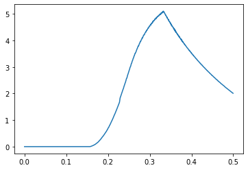

# hw1

## Q1
### 1.
正确。根据O(g(n))的定义，$\forall i \in \N ^+, \exist c_i, n_i, s.t. \forall n \ge n_i, f_i(n) \le c_i g(n)$。
令$n_0 = max\{n_1, n_2, ..., n_m\}$，则$\forall n \ge n_0, F_m(n) = \Sigma^m_{i=1}f_i(n) \le \Sigma^m_{i=1}(c_ig(n)) = (\Sigma^m_{i=1}c_i)g(n)$。
因此，$\exists c_0 = \Sigma^m_{i=1}c_i, n_0, s.t. \forall n \ge n_0, F_m(n) \le c_0g(n)$，即$F_m(n) = O(g(n))$。

### 2.
错误。反例：设$\forall i \in \N ^+, f_i(n) = n, g(n) = 2n$，则$f_i(n) = O(g(n))$。但$F(n)=\Sigma^n_{i=1}f_i(n) = n^2$。显然无论如何选取常数c，当n充分大时总有$F(n) > cg(n)$。因此，$F(n) \ne O(g(n))$。

### 3. 
正确。假设已知$f_i(n) = o(g(n))$，即$\forall c_i > 0, \exist n_i, s.t. \forall n \ge n_i, 0 \le f_i(n) < c_ig(n)$
那么取$f_{i+1}(n) = \sqrt{f_i(n)g(n)}$，则$\forall c_{i+1} > 0$，取$c_i = c_{i+1}^2$，那么$\exist n_{i+1}, \forall n \ge n_{i+1}, 0 \le f_{i+1}(n) = \sqrt{f_i(n)g(n)} \le \sqrt{c_{i+1}^2g^2(n)} = c_{i+1}g(n)$，因此$f_{i+1}(n) = o(g(n))$，类似可知$f_i(n) = o(f_{i+1}(n))$。
因此由$f_1(n) = o(g(n))$可构造出$f_2(n) = o(g(n))$，且$f_1(n) = o(f_2(n))$。由$f_2(n) = o(g(n))$可构造出$f_3(n) = o(g(n))$，且$f_2(n) = o(f_3(n))$。以此类推，存在无穷函数列$\{f_1,f_2,...\}$，$f_i(n) = o(f_{i+1}(n))$且$f_i(n) = o(g(n))$。

### 4.
不正确。取$f(n) = n \% 2, g(n) = (n+1) \% 2S$，则$f(n) + g(n) = 1 = \Omega(1)$。但$f(n) \neq \Omega(1), g(n) \neq \Omega(1)$

### 5. 
不正确。取$f(n) = n^{2+sin\frac{\pi}{4}n}$。显然$f(n) = \Omega(n), f(n) = O(n^3)$
但$f(n+1) = (n+1)^{2+sin\frac{\pi}{4}(n+1)}$，$\frac{f(n+1)}{f(n)} = (1+\frac1n)^{2+sin\frac{\pi}{4}n}(n+1)^{sin\frac{\pi}{4}(n+1)-sin\frac{\pi}{4}n}$
取$n = 8k+1$，则$sin\frac{\pi}{4}(n+1)-sin\frac{\pi}{4}n = 1-\frac{\sqrt{2}}{2}$，
$\frac{f(n+1)}{f(n)} = (1+\frac1{8k+1})^{2+sin\frac{\pi}{4}(8k+1)}(8k+2)^{1-\frac{\sqrt{2}}{2}}$。
因此任取$c>0$，k充分大时总有$\frac{f(n+1)}{f(n)} > c$。因此$f(n+1) \neq \Theta(f(n))$。


## Q2
### 1.
当$m=0$时，对任意的n，$A(0,n) = n+1$，因此此时递归定义可以终止。
假设对所有的$n\ge 0$，$m=k$时递归定义可以终止，则$m=k+1$时：
$A(k+1,n) = A(k,A(k+1,n-1)) = A(k,A(k,A(k+1,n-2))) = ... = A(k,A(k,...A(k,A(k+1,0)))) = A(k,A(k,...A(k,A(k,1))))$。由归纳假设，$A(k,n)$可以终止。因此递归定义可以终止。
由数学归纳法，递归定义可以终止。

### 2.
当$m=0$时，$A(0,n) = n+1$，显然此时对m,n是单调增的。
假设当$m \le k$时，$A(m,n)$对m,n是单调增的，则$m \le k+1$时：
$A(k+1,n) = A(k,A(k+1,n-1)) = ... = A(k,A(k,...A(k,A(k+1,0)))) = A(k,A(k,...A(k,A(k,1))))$，这里函数A嵌套了n+1层。由归纳假设，$A(k,n) \ge A(0,n) = n+1$，且$A(k,n) > n$。
因此$A(k+1,n) = A(k,A(k,...A(k,A(k,1)))) \ge A(k,A(k,...A(k,2))) \ge ... \ge A(k, A(k, n)) > A(k,n)$，即当$m \le k+1$时，$A(m,n)$对m是单调增的。
又$A(k+1, n+1) = A(k, A(k+1,n))$。由归纳假设，$A(k, n) > n$，因此$A(k, A(k+1,n)) > A(k+1,n)$。即当$m \le k+1$时，$A(m,n)$对n是单调增的。
由数学归纳法，$A(m,n)$对m,n是单调增的。

### 3. 
#### $\alpha(x) = \omega(1)$
$\alpha(x) = \omega(1) \Leftrightarrow \forall c > 0, \exist x_0 > 0, \forall x > x_0, 0 \le c < \alpha(x)$。任给$c$，取$x_0 = A(\left\lceil c\right\rceil+1, \left\lceil c\right\rceil+1)$，显然此时$\alpha(x_0) > c$。又因为$A(n,n)$单调增，因此当$x > x_0$，一定有$\alpha(x) > \alpha(x_0)$。从而$\alpha(x) = \omega(1)$。
#### $\alpha(x) = O(lg*x)$
**引理1：$A(1, n) \ge n+2$**
证明：$A(1, n) > A(0, n) = n+1, A(1, n) \ge n+2.$
**引理2：$A(2, n) \ge 2n$**
证明：显然$A(2, 0) \ge 0.$
假设$A(2, k) \ge k$，则：
$A(2, k+1) = A(1, A(2, k)) \ge A(2, k) + 2 \ge 2k + 2 = 2(k+1).$
由数学归纳法得证。
**引理3：$A(3, n) \ge 2^n$**
证明：显然$A(3, 0) \ge 1.$
假设$A(3, k) \ge 2^k$，则：
$A(3, k+1) = A(2, A(3, k)) \ge 2A(3, k) \ge 2 \times 2^k = 2^{k+1}.$
由数学归纳法得证。
**证明$\alpha(x) = O(lg^*x)$：**
要证明$\alpha(x) = O(lg^*x)$，只需证明$\exist x_0 > 0, \forall x > x_0, x \le A(lg^*x, lg^*x)$
先证明n充分大时，$A(n,n) \ge g(n)$，其中$g(n) = $ 2 ^ 2 ^ 2 ^ ... ^2（共n个2）。
当$n = 3$时，容易验证该性质成立。
假设当$n = k(k \ge 3)$时该性质成立，则$n = k+1$时：
由单调性，$A(k+1,k+1) = A(k,A(k+1,k)) \ge A(3, A(k, k)) \ge A(3, g(k)).$
由引理3， $A(3, g(k)) \ge 2^{g(k)} = g(k+1).$
由数学归纳法，当$n \ge 3$时，$A(n,n) \ge g(n)$。
由迭代对数函数的性质，易知当$lg^*x = k, g(k-1) < x < g(k)$。
因此对当x充分大时，$A(lg^*x,lg^*x) > g(lg^*x) > x $。即$\alpha(x) = O(lg^*x)$

## Q3
### 1.
1. $T(n) = \Theta(n^2)$
2. $\Theta(n^2lgn)$
3. $\Theta(2^n)$
4. $\Theta(n^nlgn)$
5. $\Theta(n^2)$
6. 无法用主方法求解。因为$n^{log_ba} = n, f(n) = nlgn = \Omega(n)$，但对任意的$\epsilon > 0, nlgn = O(n^{1+\epsilon})$。刚好处于第二和第三种情况之间。
7. 无法用主方法求解。因为$n^{log_ba} = n, f(n) = n/lgn = O(n)$，但对任意的$\epsilon > 0, n/lgn = \Omega(n^{1-\epsilon})$。刚好处于第一和第二种情况之间。
8. $\Theta(n^{0.51})$
9. $\Theta(\frac1nlgn)$
10. $\Theta(n!)$
11. $\Theta(\sqrt{n})$
12. $\Theta(n^{log_23})$
13. $\Theta(n)$
14. $\Theta(n^2)$
15. $\Theta(nlgn)$
16. $\Theta(nlgn)$
17. $\Theta(n^2lgn)$
18. $\Theta(n^2)$
19. $\Theta(n^2)$
20. $\Theta(n^2)$
21. $\Theta(n^2)$
22. $\Theta(n(2-cosn))$
23. 无法求解，因为$n^{log_ba} = n, f(n) = nlgnlglgn = \Omega(n)$，但$\forall \epsilon > 0, f(n) = O(n^{1+\epsilon})$（这是因为$nlgn = O(n^{1+\epsilon/2}), lglgn < lgn = O(n^{\epsilon/2})$）
24. 无法求解，因为当$r>0$，$n^{log_ba} = n, f(n) = n(lglgn)^r = \Omega(n)$，但$\forall \epsilon > 0, f(n) = O(n^{1+\epsilon})$（这是因为$\forall \epsilon > 0, lglgn < lgn = O(n^{\epsilon/r})$）
    当$r < 0$，同理有$f(n) = O(n)$，但$\forall \epsilon > 0, f(n) = \Omega(n^{1-\epsilon})$。
25. 无法求解。因为当$r>0$，$n^{log_ba} = n, f(n) = n\frac{(lglglgn)^s}{lgnlglgn} \neq \Theta(n)$。且由于$\forall \epsilon > 0, \lim_{n\rightarrow\infin}\frac{lgn}{n^\epsilon} = 0$，因此无论s取何值，对任给的$\epsilon > 0$，都有$f(n) \neq O(n^{1-\epsilon}), f(n) \neq \Omega(n^{1+\epsilon})$

### 2.
7. $\textbf{e} = (1,-1), T(n) = \Theta(nlglgn)$
23. $\textbf{e} = (1,1,1), T(n) = \Theta(nlg^2nlglgn)$
24. $\textbf{e} = (1,0,r), T(n) = \Theta(nlgn(lglgn)^r)$
25. $\textbf{e} = (1,-1,-1,s)$
    若$s > -1$，则$cord(\textbf{e}) = 3, cpow(\textbf{e}) = s > -1, T(n) = \Theta(n(lglglgn)^{s+1})$
    若$s = -1$，则$cord(\textbf{e}) = 4, cpow(\textbf{e}) = 0 > -1, T(n) = \Theta(n(lglglgn)^{s+1}lglglglgn)$
    若$s < -1$，则$cord(\textbf{e}) = 3, cpow(\textbf{e}) = s < -1, T(n) = \Theta(n)$


## Q4
### 1.
输入n和f时：令$s = max\{f, \frac{2n}{f}\}, t = min\{f, \frac{2n}{f}\}$。则给出$a = \frac{s-t+1}2, b = \frac{s+t-1}2$
输入n和<a,b>时，给出$f$为$a+b$和$b-a+1$中的奇数。
**伪代码：**
```C
Input: n, f
s = f > 2n/f ? f : 2n/f
t = f < 2n/f ? f : 2n/f
a = (s-t+1)/2
b = (s+t-1)/2
return a, b
```
```C
Input: n, a, b
f = a+b
if f % 2 == 0
    f = b-a+1
return f
```

### 2.
#### 正确性：
对任给的正整数n，设它除2外还有k个奇质因子$p_1, p_2, ..., p_k$，则n可以表示为$2^{s_0} {p_1}^{s_1} {p_2}^{s_2}...{p_k}^{s_k}$。由于n的正奇因子一定由这些奇质因子的幂相乘得到，第i个奇质因子在正奇因子中的幂次共有$s_i+1$种情况（即正奇因子可以包含0个，1个直至$s_i$个$p_i$），那么这k个奇质因子共有$(s_1+1) (s_2+1) ... (s_k+1)$种组合。且由质因子唯一分解定理，这样的组合不会重复。因此容易得到$|S_n| = (s_1+1) (s_2+1) ... (s_k+1)$。

算法的第1、2、3行用于除去n中所有的因子2，4至14行为关键的循环。为证明算法的正确性，将变量S在4-16行的（外层）循环中具有的性质表示为如下这个循环不变式：
**在这个（外层）循环每次迭代开始时，S是1或者是所有小于p的奇质因子对应的$s_i+1$的乘积，且所有小于p的奇质数无法整除此时的n。**
下面证明这个循环不变式的三条性质：
**初始化：** 显然开始前S为1，且p初始为3，没有小于p的奇质数。
**保持：** 若当p=q这次迭代开始前时该不变式成立，则下一次迭代（p=q+1）开始前：
若q不是n的一个奇质因子，那么要么q是偶数，或者q是奇质数但不是n的因子，q不能整除n，因此S被乘上1，循环不变式保持；要么q是奇数但不是质数，那么由循环不变式的性质，q中的奇质因子无法整除n，因此q无法整除n，S被乘上1，循环不变式保持。
若q是n的一个奇质因子，则在下一次迭代开始前，内层循环已经尽可能多地从n中除去q，且用e记录了除的次数。因此下一次迭代前q无法整除n，S被乘上e+1，循环不变式保持。
**终止：** 最终当$p^2 > n$时循环终止。所有小于p的奇质数对应的$s_i+1$已经被乘到S上。此时若n为1，则说明所有可能的质因子已被考虑在内，S即为$|S_n|$。若n不为1，此时n必为奇质数（首先必定为奇数，其次若不为质数，那么考虑此时n中最小的质因子$p_m$：若$p_m < p$，则由循环不变式$p_m$不能整除n，矛盾；若$p_m > p$，由于n不为质数，必有$n > p_m^2 > p^2$，矛盾）。因此此时的n是唯一一个未被考虑的质因子，$S_n = 2S$。

根据循环不变式的性质，最后根据n是否为1决定是否将S乘2，即可得到$|S_n|$。算法的正确性得证。

#### 复杂度：
计算时间复杂度，只需考虑其中的两处循环即可。
不妨设$n = 2^{s_0} {p_1}^{s_1} {p_2}^{s_2}...{p_k}^{s_k}$，$p_1, p_2, ..., p_k$是n的所有奇质因子。那么第一个循环执行次数为$s_0$次。第二个循环最坏情况要从$p=3$迭代到$p = p_k$，其中内层循环对每个$p_i$执行$s_i$次，外层循环中的其余语句对每个$3\le p \le p_k$执行一次。可以列出下面的表格：
|行数|代价|次数|
|-|-|-|
|1|$c_1$|$s_0$|
|2|$c_2$|$s_0$|
|3|/||
|4|$c_4$|1|
|5|$c_5$|1|
|6|$c_6$|$p_k-2$|
|7|$c_7$|$p_k-2$|
|8|$c_8$|$\Sigma^{k}_{i=1}s_i$|
|9|$c_9$|$\Sigma^{k}_{i=1}s_i$|
|10|$c_{10}$|$\Sigma^{k}_{i=1}s_i$|
|11|/||
|12|$c_{12}$|$p_k-2$|
|13|$c_{13}$|$p_k-2$|
|14|/||
|15|$c_{15}$|1|
|16|$c_{16}$|1|
|17|/||
|18|$c_{18}$|1|

因此总代价为$(c_1+c_2)s_0 + (c_6+c_7+c_{12}+c_{13})(p_k-2) + (c_8+c_9+c_{10})\Sigma^{k}_{i=1}s_i + c_4+c_5+c_{15}+c_{16}+c_{18}$。最坏情况下，$s_0 = lgn, p_k-2 = \sqrt{n}-2, \Sigma^{k}_{i=1}s_i = log_3n$，因此只需考虑$\sqrt{n}$，由此可知最坏情况下的时间复杂度为$T(n) = O(\sqrt{n}) = O(2^{\frac{m}{2}})$
另外，当n充分大时，由于$\frac{n}{2}$和$n$之间必然有一个素数$p$，因此无论n取多大，总有$n' = p^2 > n$使得算法的执行次数为$\sqrt{n'}$，因此最坏时间复杂度$T(n) = \Omega(n) = \Omega(2^{\frac{m}{2}})$。
综上，$T(n) = \Theta(2^{\frac{m}{2}})$

### 3.
#### 3.1
不能断言最坏时间复杂度为$\Omega(2^{\alpha m}) \bigcap O(2^\beta m)$。这是因为$\{L_i\}$依分布收敛于$L$只能保证$P(\alpha \leq L_i \leq \beta) \rightarrow P(\alpha \leq L \leq \beta) = 1$，但对每个具体的i，$P(L_i < \alpha \bigcap L_i > \beta)$不一定为0。
不能断言平均时间复杂度为$\Theta(2^{\gamma m})$。假设某算法仅在$X_i = 2^{i-1}$时,$T(X_i) = 2^iX_i^{2\gamma}$，其余情况下的时间复杂度均为$T(X_i) = X_i^\gamma$。易知${L_i}$依概率收敛于$L = \gamma$，但平均时间复杂度$T > \frac{2^iX_i^{2\gamma}}{2^i} \neq 2^{\gamma m}$。

#### 3.2
阅读论文可知，$P(L \leq x) = G(x)$。$G'(x)$即为概率密度函数
绘制$G'(x)$图像如下：

在x为0.33处取得最大值，最大值为5.11。