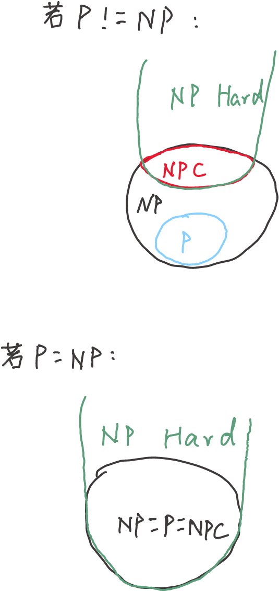
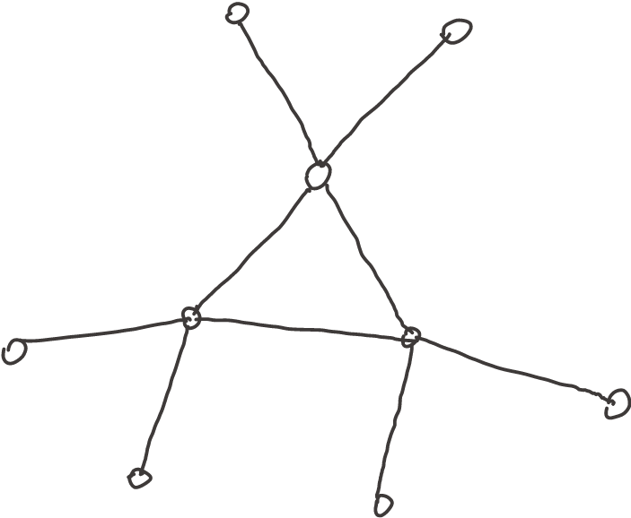
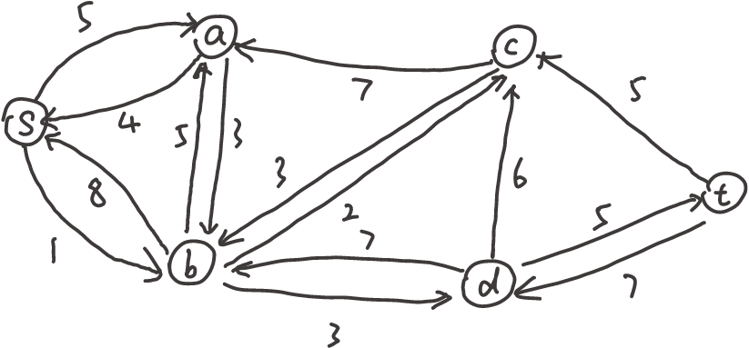
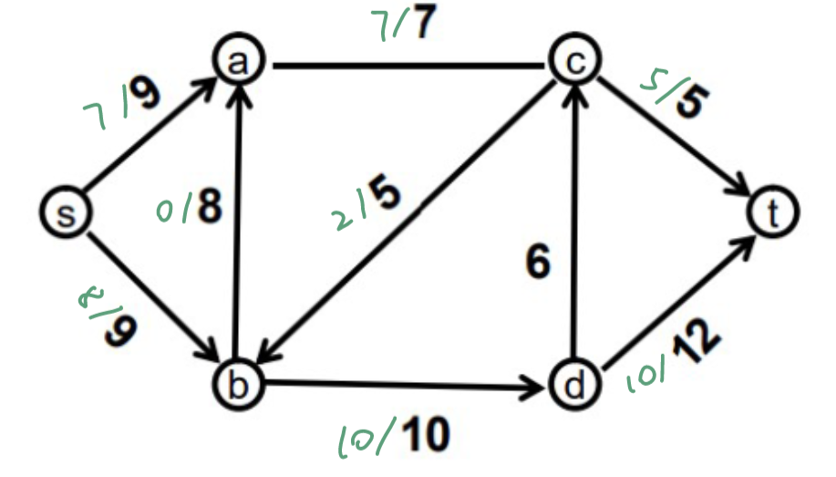

## Q1

## Q2
如图：

该图的最优顶点覆盖只需要3个顶点（即中间的三角形），但APPROX-VERTEX—COVER算法每次迭代都会向C中加入两个新顶点，因此APPROX-VERTEX—COVER算法最好情况下也只能求得4个顶点的解，即总是产生次优解。

## Q3
首先，如果T和T'长度不等，则必然不是循环旋转。
如果长度相等，那么将字符串T复制一份，连接在他自身后面得到一个新字符串（如：字符串"car"变为"carcar"）。然后用KMP算法求解T'在新字符串中的匹配位置，如果有匹配位置，则说明它们是彼此的循环旋转，否则不是。

## Q4
### (a)
如图所示：

### (b)
路径sabdt提升最大。
### (c)
如图：

## Q5
感觉之前的一些作业里数学太多了，不太像算法作业。