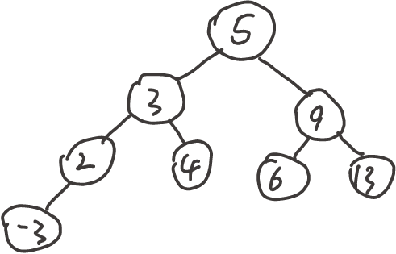

# Q1
## 1
$H_{max} = 7, H_{min} = 3$
树高为$H_{max}$的树：

树高为$H_{min}$的树：


## 2
如图：


# Q2
## 1
```
InOrderTreeWalk_Leaf(x)
    if x != NIL then
        InOrderTreeWalk_Leaf(left[x])
        if left[x] == NIL and right[x] == NIL
            print key[x]
        InOrderTreeWalk_Leaf(right[x])
```

## 2
<!--
```python
TreeSearch(x, k)
    Sleft = {}
    Sright = {}
    print("Spath:{")
    while x != NIL and k != key[x]
        print(key[x])
        if k < key[x]
            Sright = Sright + {right[x]}
            x = left[x]
        else
            Sleft = Sleft + {left[x]}
            x = right[x]
    if x != NIL
        print(key[x])
    print("},Sleft:")
    for each y in Sleft
        InOrderTreeWalk(y)
    print("},Sright:{")
    for each y in Sright
        InOrderTreeWalk(y)
    print("}")
```-->
```python
TreeSearch(x, k)
    Sleft = {}
    Sright = {}
    Spath = {}
    while x != NIL and k != key[x]
        Spath = Spath + {x}
        if k < key[x]
            InOrderTreeWalk(right[x], Sright)
            x = left[x]
        else
            InOrderTreeWalk(left[x], Sleft)
            x = right[x]
    if x != NIL
        Spath = Spath + {x}
    print("Spath=" + Spath)
    print("Sleft=" + Sleft)
    print("Sright=" + Sright)
```
其中InOrderTreeWalk为修改过的中序遍历算法，定义如下：
```python
InOrderTreeWalk(x, S)
    if x != NIL then
        InOrderTreeWalk(left[x])
        S = S + {x}
        InOrderTreeWalk(right[x])
```
## 3
这个算法中用到了集合这一种特殊的数据结构。假定集合的插入操作时间代价为$O(1)$的，打印整个集合中元素的操作时间代价为$O(n)$，n为集合中元素数量。那么
这个算法的时间复杂度为$\Theta(n)$，其中n为树中的节点数。

首先，对于InOrderTreeWalk，由于集合的插入操作时间代价为$O(1)$的，因此它的时间复杂度是$O(n)$的，这里的n是InOrderTreeWalk遍历的节点数。

对于TreeSearch算法，一方面，所有在搜索路径上的节点都会被访问一次。而不在搜索路径上的节点，根据树的连通性，它们必有一个祖先与搜索路径上的节点相连，这个祖先在搜索过程中或被加入Sleft，或被加入Sright，因此不在搜索路径上的节点也会（在调用中序遍历时）被访问一次。因此，所有节点都会被访问一次，每次访问时会执行一次插入集合的操作，时间复杂度为$\Omega(n)$。

另一方面，该算法中的几个主要部分为while循环。while循环会对搜索路径上的每个节点做代价为$O(1)$的操作，因此这一部分的时间代价为$O(n)$的（准确来说是$O(h)$的）；而对于非搜索路径上的节点，会调用InOrderTreeWalk将以它们为根的子树上所有节点加入Sleft或Sright。下面先证明，对于while循环中遍历到的两个非搜索路径上的节点x，y，以x为根的子树和以y为根的子树必然不相交。
- 若x = y，由于x和y的父节点必然在搜索路径上，且对于搜索路径上的每个节点，只会对它的其中一个子节点进行一次中序遍历，因此x有两个不同的父节点，这是不可能的。
- 若y在x的子树中，由于y的父节点在搜索路径上，x不在搜索路径上，因此是不可能的。同理，x也不可能在y的子树中。
- 若存在一个节点c，既在x的子树中，又在y的子树中，那么从c向上寻找它的祖先，必然会先后找到x和y（或先y后x），这与上一种情况相同，也是不可能的。

因此，对于while循环中的非搜索路径上的节点，相当于用中序遍历遍历了这棵树中一些不相交的子树，遍历的节点数一定小于等于n，因此这一部分的时间代价都是$O(n)$的。
除这三个循环外，打印集合中元素的时间代价为$O(n)$，其余部分时间代价都是$O(1)$的，因此整个算法的时间代价为$O(n)$。

综上，该算法的时间复杂度为$\Theta(n)$。

## 4
### (1)
正确。
从定义可知，从a向上找它的祖先，一定存在一个祖先，它不在$S_{path}$上，且是$S_{path}$中某个节点$x$的左孩子（这里允许这个祖先是a自己）；同理，也一定存在b的某个祖先（或是b自己），它不在$S_{path}$上，且是$S_{path}$中某个节点$y$的右孩子。这里x和y必不相同（否则x的两个子节点都存在且都不在$S_{path}$上，这是不可能的）。
那么，x和y中一定有一个在另一个的子树上。若y在x的子树上，那么y一定在x的右子树上（否则y在x的左子树上，而a的某个祖先（不妨设它为c）是x的左孩子，且不在搜索路径上，那么y只能在c的子树上，即x到y的路径上有不在搜索路径上的节点，这是不可能的。因此a在x的左子树上，b在x的右子树上，一定有$a \le b$。同理，若x在y的子树上，那么x只能在y的左子树上，因此a在x的左子树上，b在x的右子树上，也一定有$a \le b$。
综上，$a \le b$是正确的。

### (2)
正确。
首先考虑a。在(1)的基础上，存在某个节点x，a在x的左子树上，且x的左孩子不在搜索路径上。那么，搜索算法迭代到x后会向右搜索，k所在节点在x的右子树上。因此有$a \le k$。
考虑b时同理，存在某个节点y，b在y的右子树上，k所在节点在y的左子树上。因此有$k \le b$。

### (3)
错误。如下图所示：


# Q3
首先证明一个引理：对任意一个含n个节点的二叉搜索树，至多通过n-1次右旋，可以将它变为一条右侧伸展的链。
首先，定义一个二叉搜索树上“最右侧的链”：它是由从根节点开始，不断访问当前所在节点的右孩子，直至遇到NIL，这个过程中经过的节点连接成的路径。那么根据右旋操作的定义，选定最右侧的链上任意一个左孩子不为空的节点（如果有的话），那么最右侧的链的长度将增加1。由于最右侧的链上至少有1个节点（根节点），因此至多通过n-1次右旋操作就可以将所有的节点移到最右侧的链上，即至多通过n-1次右旋就可以把任意一颗含n个节点的二叉搜索树变为一条右侧伸展的链。

然后证明题中所给命题。由于右旋和左旋互为逆操作，即对一个二叉搜索树进行右旋后，再进行相应的左旋，即可将它变回原来的二叉搜索树。因此在引理的基础上，对于一个长度为n的右侧伸展的链，至多对它进行n-1次左旋，即可将它变为任意一个给定的含n个节点的二叉树。基于此，对于任意一棵含n个节点的二叉搜索树，先对它进行至多n-1次右旋，将它转变为右侧伸展的链，再进行至多n-1次适当的左旋，即可将它变为其他任何一棵含n个节点的二叉搜索树。总计至多需要进行2n-2次旋转操作。

综上，任何一棵含 n个结点的二叉搜索树可以通过$O(n)$次旋转，转变为其他任何一棵含n个结点的二叉搜索树。

# Q4
不一样，下图是一个反例。


# Q5
