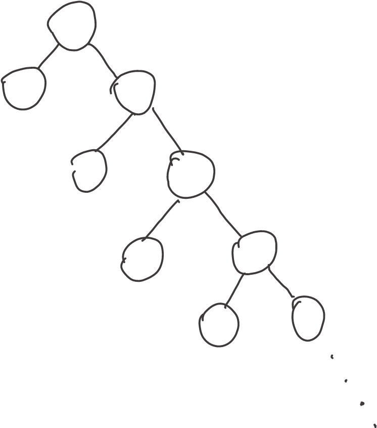

## Q1
### 1
赫夫曼编码为：
|字符|a|b|c|d|e|f|g|h|
|-|-|-|-|-|-|-|-|-|
|出现频率|1|1|2|3|5|8|13|21|
|编码|1111111|1111110|111110|11110|1110|110|10|0|
### 2
推广后的结论如下：
对于这样的一组字符集，第一个字符的最优前缀编码为连续的n-1个1，第i个字符（i >= 2）的最优前缀编码为连续的n-i个1后跟1个0（第n个则只有一个0）。这里假定斐波那契数列的第1、2项均为1。

下面证明，按赫夫曼编码的构造过程，可以得到上述的编码。

我们采用这样的策略来构造赫夫曼编码（或者说赫夫曼树）：合并两颗二叉树时，将权值大的作为右子树；如果在构造过程中需要将根节点权值相同的一个单节点二叉树和一个多节点二叉树合并，我们将单节点二叉树作为左子树，多节点二叉树作为右子树。

首先证明：构造赫夫曼树的过程中，在第i轮迭代后，森林中有n-i-1棵单节点的二叉树，1棵多节点的二叉树。且多节点二叉树的根节点的权重大于等于剩余单节点二叉树中最小的权值（如果有的话），小于剩余其他单节点二叉树的权值（这样的话按我们的构造策略，第i+1轮迭代时，会选择这棵多节点二叉树和权值最小的一棵单节点二叉树合并，且多节点的二叉树为右子树）。

显然，第一轮迭代后合并两个权值为1的单节点二叉树，得到根节点权值为2的多节点二叉树，剩余n-1个单节点二叉树，权值为2，3，5，8，13，……，该结论成立。

假设该结论对前k轮迭代成立，则对第k+1轮迭代：
- 首先，第k+1轮迭代会选择权值最小的单节点二叉树，和唯一的一棵多节点二叉树合并，且多节点二叉树为右子树。由归纳假设，第k轮迭代后森林中有n-k-1棵单节点二叉树，1棵多节点二叉树，那么这样合并后单节点二叉树数量减1，有n-k-2棵，多节点二叉树数量仍为1棵，符合上面的结论。
- 设（第k+1轮迭代合并前）选中的这棵权值最小的单节点二叉树权值为$w_s$，权值第二小的单节点二叉树和第三小的单节点二叉树权值分别为$w_s', w_s''$（如果有的话），多节点二叉树根节点权值为$w_m$，由归纳假设，$w_s' > w_m \ge w_s$。那么合并后得到的二叉树根节点权值为$w_m+w_s$。根据斐波那契数列的性质，$w_s' \le 2w_s \le w_m+w_s$，$w_s'' = w_s'+w_s > w_m + w_s$。那么合并后原本第二小的单节点二叉树变为最小的单节点二叉树，且它的权值小于等于合并后的多节点二叉树的权值；原本第三小的单节点二叉树变为第二小的，且它的权值大于合并后的多节点二叉树的权值。符合上面的结论。

根据数学归纳法，该结论成立。

那么可以推知，权值第i小的节点会在第i-1轮迭代时被合并（最小的2个节点会在第1轮一起被合并），最后构造出的赫夫曼树形状如下图所示：除根节点外，每一层只有2棵子树，且左侧的子树为单节点的二叉树。

最后一层的两个叶子节点对应两个频率为1的字符，其余的叶子节点中，越靠上的叶子节点对应的字符的频率越大。因此，如果按“向左走为0，向右走为1”的策从赫夫曼树构造赫夫曼编码，则会得到上面的编码。

由于赫夫曼编码是最优前缀编码，因此上面的编码是最优前缀编码。

## Q2
设$3^m \le n < 3^{m+1}$
那么，这n次操作中有m次代价为$2i$，剩余的代价为1。
这m次操作的总代价为$2*(3+3^2+3^3+...+3^m) = 3^{m+1}-3$
剩余的n-m次操作的总代价为$n-m$。
由于$m \le \log_3n < m+1$，因此$m=O(\log n)$。总代价为$3^{m+1}-3+n-m=O(n)$。
因此每个操作的摊还代价为$O(n)/n=O(1)$。

## Q3
证明：
首先证明一个引理：由于最高的频率低于最低频率的2倍，因此对于任意的$n\le 128$，频率最高的n个字符的频率和低于高于频率最低的n个字符频率和的2倍。不妨设频率最低的字符频率为$c_m$，最高的为$c_M$。那么容易得到：$频率最高的n个字符频率和 \le nc_M < 2nc_m \le 频率最低的n个字符频率和的2倍$。

因此，构建赫夫曼树时，最初频率最低的两个字符的频率加起来，就已经超过了频率最高字符的频率，算法会将字符两两一组合成一个二叉树，得到有128个2叉树的森林，其中每个二叉树的根节点频率为两个字符的频率和。由上面的引理，此时频率最低的两个二叉树的根节点频率和会超过频率最高的根节点，因此这些二叉树又会被两两一组合成64个二叉树……这一过程不断进行下去，最后会得到一个高度为8的完全二叉树，因此每个字符的编码长度都为8，并不比8位固定长度编码更有效。

## Q4
用归纳法证明。

首先，当编码树高度为2时，该结论显然成立。这里的高度定义为根节点到叶子节点的最长路径上的节点数。

假设当编码树高度为n（$n \ge 2$）时成立，则当编码树（设为$T$）高度为n+1时，不妨设左子树（设为$T_{left}$）高度为n，右子树（设为$T_{right}$）高度为m（$m \le n$）。

由归纳假设，如果把子树看成一棵独立的编码树，那么它的总代价为所有内部节点的两个孩子节点的联合频率之和，同时根据总代价的定义，总代价也为$\Sigma_{c\in T_{child}} c.freq \cdot d_{T_{left}}(c)$，其中$T_{child}$表示根节点的任意一棵子树。又由于子树中任意一个节点c在整个树T中的码长为$d_T(c) = d_{T_{child}}(c)+1$，因此树T的总代价为

$$\begin{aligned}
B(T) &= \Sigma c.freq \cdot d_T(c) \\
&= \Sigma_{c\in T_{left}} c.freq \cdot d_{T_{left}}(c) + \Sigma_{c\in T_{left}} c.freq + \Sigma_{c\in T_{right}} c.freq \cdot d_{T_{right}}(c) + \Sigma_{c\in T_{right}} c.freq \\
&= \Sigma_{c\in T_{left}} c.freq \cdot d_{T_{left}}(c) + \Sigma_{c\in T_{right}} c.freq \cdot d_{T_{right}}(c) + (\Sigma_{c\in T_{left}} c.freq + \Sigma_{c\in T_{right}} c.freq)
\end{aligned}
=$$

其中由归纳假设，$\Sigma_{c\in T_{left}}c.freq \cdot d_{T_{left}}(c)$即为左子树中所有内部节点的两个孩子节点联合频率和；$\Sigma_{c\in T_{right}}c.freq \cdot d_{T_{right}}(c)$即为右子树中所有内部节点的两个孩子节点联合频率和；$\Sigma_{c\in T_{left}} c.freq$为根节点左孩子的频率，$\Sigma_{c\in T_{right}} c.freq$为根节点右孩子的频率，$(\Sigma_{c\in T_{left}} c.freq + \Sigma_{c\in T_{right}} c.freq)$即为根节点两个孩子的联合频率和。因此，T的代价可以表示为左右子树中所有内部节点的两个孩子的联合频率和+根节点两个孩子的联合频率和。而T的内部节点只有左右子树中的内部节点和根节点，因此高度为n+1时该结论成立。

综上，由归纳法可得，该结论成立。

## Q5
### 1
用这样的贪心策略找最优解：对于剩余的未找零的零钱，总是优先找面值最大的零钱。证明如下：

当n等于某一种硬币面额时，显然贪心算法是正确的。

当n不等于某一种硬币面额时：

首先，由于有1分面额的硬币，因此对于任意的零钱面额，总是可以找到对应面值的零钱。因此，这样的贪心策略总是可以找到一个解。

其次，该问题有最优子结构。如果为n分零钱找零的最优解包含面值为c分（把5角、2角、1角看作50分、20分、10分）的硬币，该最优解一定包含为n-c分零钱找零的最优解，否则可以用n-c分零钱找零的最优解替换，得到更优的解。

最后，贪心选择一定是安全的，即对于任意一个n分零钱找零问题，一定存在一个包含小于等于n分的面值最大硬币的解（做出贪心选择后还是存在最优解）。用$c_1, c_2, ..., c_6$分别表示5角、2角、1角、5分、2分、1分硬币的数量。首先证明：最优解一定满足下列条件：
1. $c_6 \le 1, c_5 \le 2, c_5 + c_6 \le 2$
2. $c_3 \le 1, c_2 \le 2, c_3 + c_2 \le 2$
3. $c_4 \le 1, c_1 \le 1$
- 对于条件1，任取一个最优解，若它不满足该策略，则：
  - 若$c_6 > 1$，可以将一分硬币两两合并成2分硬币，直至$c_6 \le 1$，得到一个更优的解，与最优解矛盾。因此最优解中一定有$c_6 \le 1$。
  - 若$c_5 > 2$，那么将3个2分硬币换成一个5分硬币和一个1分硬币，得到更优的解，与最优解矛盾。因此最优解中一定有$c_5 \le 2$。
  - 若$c_5+c_6 > 2$，那么只能为$c_5 = 2, c_6 = 1$，则可以将2个2分硬币和1个1分硬币换成1个5分硬币，得到更优的解，与最优解矛盾。
- 对于条件2，与条件1同理。
- 对于条件3，若$c_4 > 1$，则可以将2个5分硬币换成1个1角硬币，得到更优的解，与最优解矛盾。若$c_1 > 1$，则总面值大于99分，不合题设。

因此，最优解一定满足上述条件。且由该性质可以推知：对于任意一种面值的硬币，最优解中小于该面值的硬币面值之和一定小于等于该面值。由于硬币面值种类是有限的，这一点很容易验证，如对于5分硬币，2分和1分硬币的面值之和最大为$2*2+0*1=4$分；对于2角硬币，1角到1分硬币的面值之和最大为$1*10+5*1+2*2+1*0=19$分，小于2角。

那么，如果有一个最优解不含小于等于n的面值最大的硬币（设这个面值为s），那么该最优解由面值小于s的硬币组成，这些硬币的面值之和为n，n大于等于s，与上面的结论矛盾。因此任意一个最优解一定包含小于等于n的面值最大的硬币。贪心选择是安全的。

综上，该贪心策略总是可以找到一个最优解。

### 2
证明如下：
首先，$c^0=1$，因此一定可以找到解。

其次，该问题有最优子结构，这一点与1中的证明一致。

最后，贪心选择一定是安全的。首先，最优解中除面值最大的硬币外，任意一种面值的硬币数量一定小于c。否则可以将c个这种硬币合成一个面值更大的硬币，得到更优的解，与最优解矛盾。由此可知，对于任意一种面值的硬币，任意一个最优解中小于该面值的硬币面值之和一定不超过它的面值（设这个硬币面值为$c^m$，小于等于它的硬币面值之和至多为$(c-1)*(c^0 + c^1 + ... + c^{m-1}) = c^m-1$）。由此与1中同理可知，对于n分零钱的找零问题，任意一个最优解一定包含小于等于n的面值最大的硬币。贪心选择是安全的。

综上，该贪心策略总是可以找到一个最优解。

### 3
硬币面额为：1分，4分，5分，6分。那么对于9分硬币的找零问题，贪心算法会先选择6分硬币，再选3个1分硬币，总共4个硬币。但最优解为5分和4分硬币，一共2个硬币。