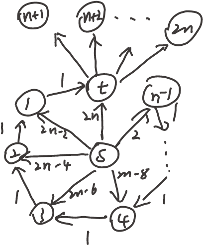
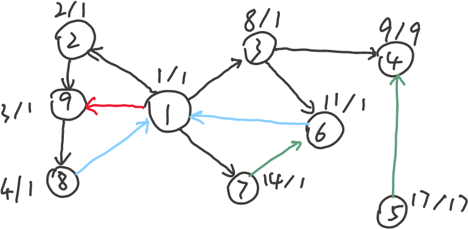
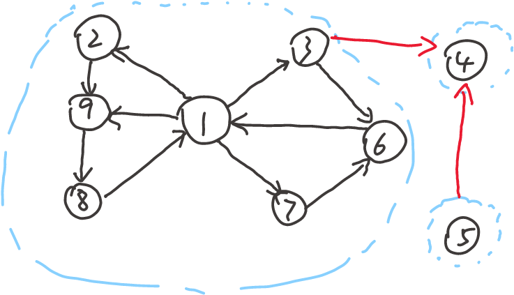
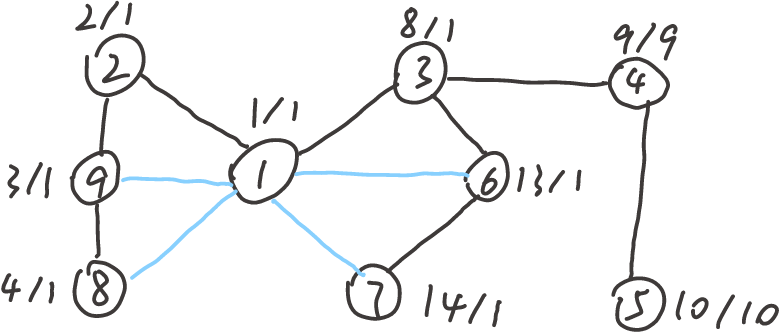
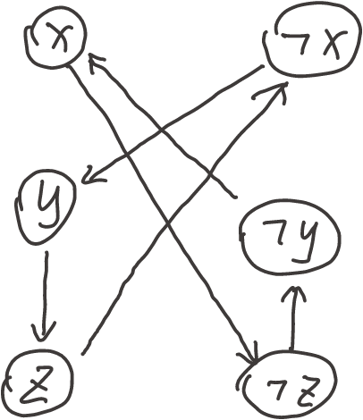
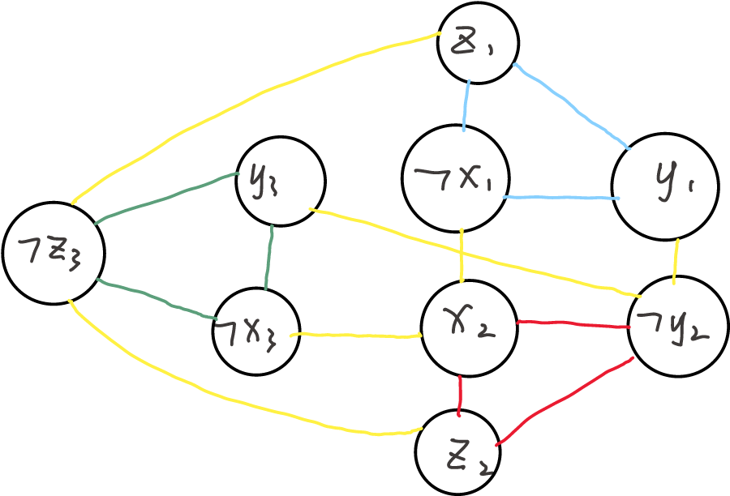

## Q1
### (1)
#### (1.1)
最短路径上至少有2个节点，因此$\phi (s, v)$至少为2.
显然，对于满足$\phi (s, v) = 2$的每一个顶点$v$，它们的最短路径可以在第1轮被确定（用s relax）。
假设对于满足$\phi (s, v) \le k$的每一个顶点$v$，它们的最短路径可以在第$k-1$轮被确定。那么对于满足$\phi (s, v) = k+1$的任意一个顶点$v$：
设在从s到v的节点最少的最短路径上，与v相邻的节点为u。显然，$\phi (s, u) \le k$，因此由归纳假设，在第$k-1$轮时，u的最短路径已经被确定。那么在第$k$轮时，v的最短路径可以在被u松弛后确定。
由数学归纳法，该引理得证。
#### (1.2)
如图，构造这样一张图：
（图中t到节点n+1, n+2, ..., 2n的边权未标出，因为它们的值不影响时间代价）

图中$|V_{n,m}|=2n+1=\Theta(n), |E_{n, m}| = 3n-1 = \Theta(m)$。其中$m=n-1$
假设访问s的邻接节点时，访问顺序为t->1->2->...->n-1（不妨设t的标号为0，访问邻接节点时按标号升序访问）。
那么第一轮将$t, 1, ..., n-1$全部用s松弛，此时队列头部为t，尾部为n-1。
第二轮首先将t出队，然后用t松弛$n+1, n+2,..., 2n$，然后用1松弛t，用2松弛1，...，用n-1松弛n-2。n+1到2n节点没有出边，因此出队后不会松弛任何节点，此时队列头部为t，尾部为n-2。
第三轮首先将t出队，然后用t松弛$n+1, n+2,..., 2n$，然后用1松弛t，用2松弛1，...，用n-2松弛n-3。n+1到2n节点没有出边，因此出队后不会松弛任何节点，此时队列头部为t，尾部为n-3。
......
最后一轮（此时已执行$\Theta(n)$轮）队头队尾都只有t，因此只会用t松弛$n+1, n+2,..., 2n$，待$n+1, n+2,..., 2n$全部出队后算法结束。
可以看到，每一轮都会用t松弛$n+1, n+2,..., 2n$，因此总共需要$\Omega(n^2)$时间。由于m=n-1，$T(n,m) = \Omega(n^2)=\Omega(nm)$

### (2)
#### (2.1)
原始的Dijkstra算法基于这样的假设：在每一轮迭代结束后，剩余最短路径未被确定的顶点中，距离源点最近的顶点一定已经达到最短路径。因为在该顶点的相邻顶点中，比它先确定最短路径的顶点已经被用来松驰过它；而还未确定最短路径的节点，它们到源的距离更远，加上一个非负的权值后一定大于这一轮确定的顶点到源的距离，因此也不可能松弛该顶点使它路径更短。然而，如果有负权边，那么到源的距离更远的顶点加上一个负权值，有可能比当前顶点到源距离更近，该假设不成立（比如，假设某一轮迭代后，剩余顶点中距源最近的顶点为A，到源的距离为10，但是有另一个到源距离15的顶点B，它和A之间的边权为-7，那么A到源的最短路径长度不会超过15-7=8，小于当前得到的10）。

但是，该算法中允许已经被加入S中的顶点的最短路径被更新（并将它从S中去除）。因此即使有负权边，也可以利用负权边来松弛顶点，得到更短的路径。

## Q2
### (1)
#### (1.1)
如图：图中黑色的为树边，红色的为前向边，蓝色的为后向边，绿色的为横向边。节点旁的数字中，斜杠左边的为dfn，右边的为low。
这里编号时考虑了每个节点在dfs时的finish time（图上未标出finish time），因此节点的编号不是连续的。

强连通分量如图所示：

#### (1.2)
如图：图中黑色的为树边，蓝色的既是前向边也是后向边，没有横向边。节点旁的数字中，斜杠左边的为dfn，右边的为low。
这里编号时同样考虑了每个节点在dfs时的finish time。

割点有1，3，4。桥有(3, 4)，(4, 5)。

### (2)
伪代码如下：
```
int time;
calc_low(G)
{
    for each v in G.V
        v.color = white;
        v.p = NIL;
    time = 0;
    for each v in G.V
        if v.color == white
            dfs(v);
}
dfs(v)
{
    time = time + 1;
    v.dfn = time;
    v.low = time;
    v.color = gray;
    for each u in G.Adj[v]
        if u.color == white
            u.p = v;
            dfs(u);
            v.low = min(v.low, u.low);
        else if u.color == gray
            v.low = min(v.low, u.dfn);
    v.color = black;
    time = time + 1;
    v.f = time;
}
```
## (3)
### (3.1)
low值相同的节点构成一个强连通分量。
### (3.2)
如果节点v的low值等于它的dfn值，那么v是一个割点。
如果存在(v, u)，且low[u] >= dfn[v]，那么v是一个割点。
### (3.3)
如果边(u, v)是树边，且节点v的low值大于等于节点u的dfn值，那么边(u, v)是桥。

## Q3
### (1)
算法如下：
设节点的编号为1, 2, ..., n。
1. 跑一遍Floyd-Warshall算法，并且记录下所有的中间结果，得到任意两点间仅使用节点$1, 2, ..., k, \forall k \in \{1, 2, ..., n\}$的最短路径。
2. 对于每一个节点$i(i \ge 3)$，执行如下操作：
对每一对满足$u < i, v < i$，且存在边$<u, i>, <i, v>$的$u,v$，如果存在从v到u的仅使用节点$1, 2, ..., i-1$的最短路径，那么用该路径加上边$<u, i>, <i, v>$得到一个环。
3. 在上述过程中得到的环中，求出最小的一个就是所求最小环。

时间复杂度：
- 第一步最坏时间复杂度为$O(V^3)$
- 第二步最坏情况下，对每一个i，u和v至多各有$O(V)$种选择，两两任意配对至多有$O(V^2)$种组合，对每一种组合，最短路径只需查表就可得到（尽管查表得到最短路径的过程可能是$O(V)$的，但是可以在这里仅记录环的大小和对应的最短路径是哪条，在第三步中再根据这些信息构造环。这样查表得最短路径的时间代价就是$O(1)$的），因此最坏时间复杂度为$O(V^3)$。
- 第三步中，由于第二步至多有$O(V^3)$个环，因此选取最小环的过程最坏时间复杂度为$O(V^3)$。如果上一步中仅记录环的大小和对应的最短路径是哪条，那么构造环的过程最坏时间复杂度为$O(V)$。因此第三步的最坏时间复杂度为$O(V^3)$。

综上，整个算法的最坏时间复杂度为$O(V^3)$。

### (2)
#### (2.1)
用dijkstra算法求出以s为源点的最短路径，对每一个存在边<t, s>的顶点t，从s到t的最短路径（如果存在的话）加上边<t, s>可以得到一个环，取这些环中最小的一个，就是所求最小环。

该算法的最坏时间复杂度为dijkstra算法的最坏时间复杂度加上选取最小环过程的最坏时间复杂度。在使用斐波那契堆维护优先队列的情况下，前者时间复杂度为$O(|V|log|V|+|E|)$；后者的最坏时间复杂度为$O(|V|)$，因此最坏时间复杂度为$O(|V|log|V|+|E|)$。

#### (2.2)
对每一个存在边<t, s>的顶点t，执行如下操作：
- 1. 如果不存在反向平行边<s, t>，则用dijkstra算法求s到t的最短路径（如果存在的话），加上边<t,s>得到一个环。
- 2. 如果存在反向平行边<s, t>，那么去掉边<s, t>，用dijkstra算法求s到t的最短路径（如果存在的话），加上边<t, s>得到一个环。

在上述过程中得到的环中，最小的一个就是所求最小环。
该算法最坏情况下会重复V次dijkstra算法，且需要$O(|V|)$时间选取最小环，因此最坏时间复杂度为$O(|V|^2log|V|+|V||E|)$

### (3)
可以通过dfs求解。
由于是连通无向图，因此从任意一个顶点开始都可以遍历所有节点。任选一个起始节点s，在dfs过程中，用一个dis数组记录当前走过的路径上，所有节点沿当前路径到s的距离（如当前走过s->u->v->w，则记录dis[w]为边su, uv, vw的权值和）。如果在访问某个节点v时，发现v的一个相邻顶点u在当前已经走过的路径上，那么就得到一个环，环的大小为dis[v]-dis[u]+w(u, v)，其中w(u, v)为边uv的权值。在这个过程中不断更新最小环，最后得到的就是所求最小环。
由于边数和顶点数仅相差常数，因此该算法是关于$|V|$的线性复杂度算法。
给出伪代码如下：
```c++
min_cycle = INF;
visited[n] = {false};
dfs(G, v, dis)
{
    for each u in G.Adj[v]
        if !visited[u]
            visited[u] = true;
            dis[u] = dis[v] + w(v, u);
            dfs(u, dis);
        else
            min_cycle = min(min_cycle, dis[v] - dis[u] + w(v, u));
    visited[v] = false;
}
get_min_cycle(G)
{
    choose a vertex v;
    visited[v] = true;
    dis[v] = 0;
    dfs(G, v, dis);
    return min_cycle;
}
```


## Q4
### (1)
#### (1.1)
如图：


### (2)
#### (2.1)
如图：

（不同颜色的边仅用于在画图时区分不同三角形和三角形间的边，无其他含义）
#### (2.2)
图中的$x_2, y_3, z_1$两两不相邻。因此一个成真赋值为$x, y, z$均为真。