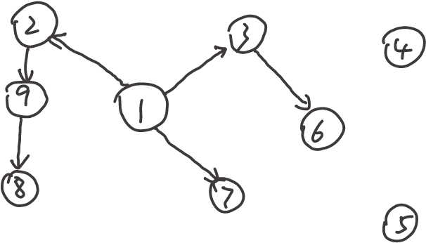

## Q1
### (1)
#### (1.1)
最短路径上至少有2个节点，因此$\phi (s, v)$至少为2.
显然，对于满足$\phi (s, v) = 2$的每一个顶点$v$，它们的最短路径可以在第1轮被确定（用s relax）。
假设对于满足$\phi (s, v) \le k$的每一个顶点$v$，它们的最短路径可以在第$k-1$轮被确定。那么对于满足$\phi (s, v) = k+1$的任意一个顶点$v$：
设在从s到v的节点最少的最短路径上，与v相邻的节点为u。显然，$\phi (s, u) \le k$，因此由归纳假设，在第$k-1$轮时，u的最短路径已经被确定。那么在第$k$轮时，v的最短路径可以在被u松弛后确定。
由数学归纳法，该引理得证。

### (2)
#### (2.1)
原始的Dijkstra算法基于这样的假设：在每一轮迭代结束后，剩余最短路径未被确定的顶点中，距离源点最近的顶点一定已经达到最短路径。因为在该顶点的相邻顶点中，比它先确定最短路径的顶点已经被用来松驰过它；而还未确定最短路径的节点，它们到源的距离更远，加上一个非负的权值后一定大于这一轮确定的顶点到源的距离，因此也不可能松弛该顶点使它路径更短。然而，如果有负权边，那么到源的距离更远的顶点加上一个负权值，有可能比当前顶点到源距离更近，该假设不成立（比如，假设某一轮迭代后，剩余顶点中距源最近的顶点为A，到源的距离为10，但是有另一个到源距离15的顶点B，它和A之间的边权为-7，那么A到源的最短路径长度不会超过15-7=8，小于当前得到的10）。

但是，该算法中允许已经被加入S中的顶点的最短路径被更新（并将它从S中去除）。因此即使有负权边，也可以利用负权边来松弛顶点，得到更短的路径。

## Q2
### (1)
#### (1.1)
如图：图中黑色的为树边，红色的为前向边，蓝色的为后向边，绿色的为横向边。节点旁的数字中，斜杠左边的为dfn，右边的为low。

强连通分量如图所示：

#### (1.2)
如图：图中黑色的为树边，蓝色的既是前向边也是后向边，没有横向边。节点旁的数字中，斜杠左边的为dfn，右边的为low。

割点有1，3，4。桥有(3, 4)，(4, 5)。

## Q3
### (1)
### (2)
#### (2.1)
用dijkstra算法求出以s为源点的最短路径，对每一个存在边<t, s>的顶点t，从s到t的最短路径（如果存在的话）加上边<t, s>可以得到一个环，取这些环中最小的一个，就是所求最小环。

该算法的最坏时间复杂度为dijkstra算法的最坏时间复杂度加上选取最小环过程的最坏时间复杂度。在使用斐波那契堆维护优先队列的情况下，前者时间复杂度为$O(|V|log|V|+|E|)$；后者的最坏时间复杂度为$O(|V|)$，因此最坏时间复杂度为$O(|V|log|V|+|E|)$。

#### (2.2)
对每一个存在边<t, s>的顶点t，执行如下操作：
- 1. 如果不存在反向平行边<s, t>，则用dijkstra算法求s到t的最短路径（如果存在的话），加上边<t,s>得到一个环。
- 2. 如果存在反向平行边<s, t>，那么去掉边<s, t>，用dijkstra算法求s到t的最短路径（如果存在的话），加上边<t,s>得到一个环。

在上述过程中得到的环中，最小的一个就是所求最小环。
该算法最坏情况下会重复V次dijkstra算法，且需要$O(|V|)$时间选取最小环，因此最坏时间复杂度为$O(|V|^2log|V|+|V||E|)$

## Q4
### (1)
#### (1.1)
如图：

### (2)
#### (2.1)
如图：

（不同颜色的边仅用于在画图时区分不同三角形和三角形间的边，无其他含义）
#### (2.2)
图中的$x_2, y_3, z_1$两两不相邻。因此一个成真赋值为$x, y, z$均为真。