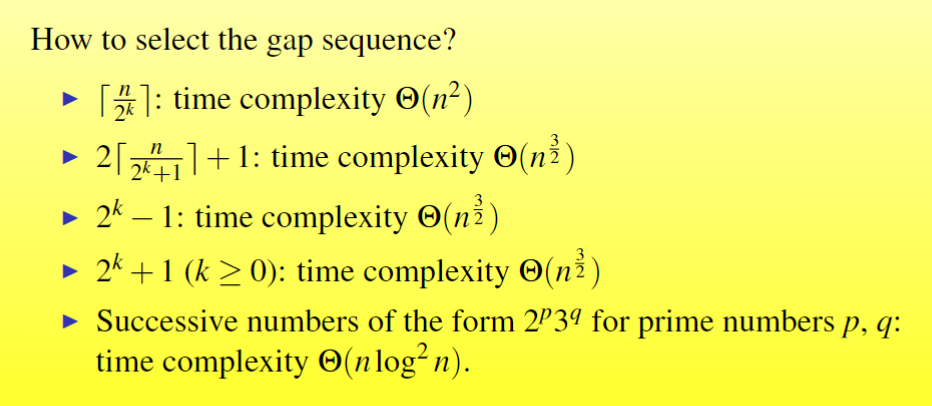
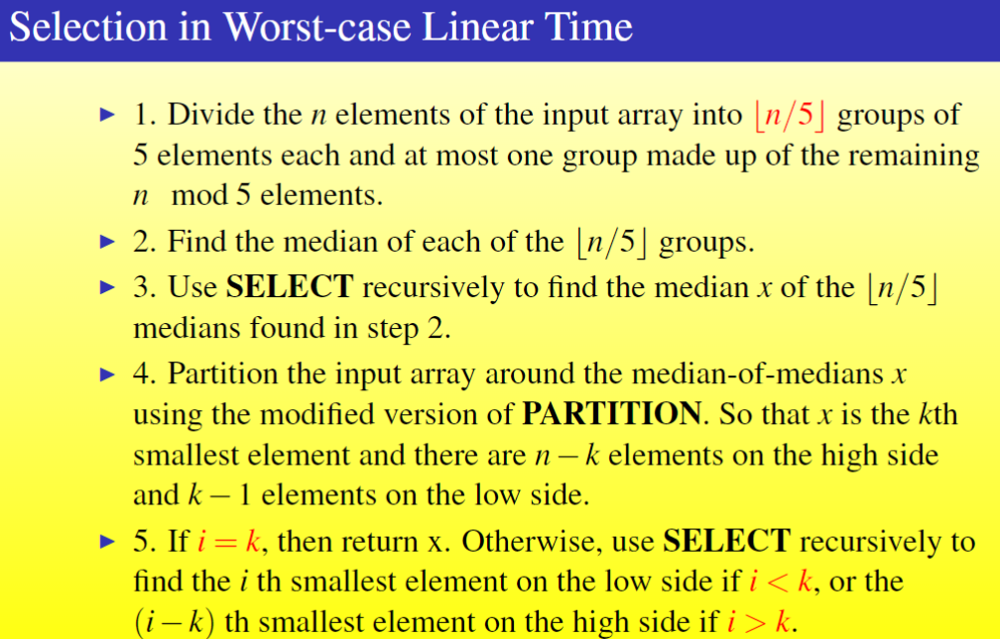

## 渐近符号
$O(g(n)) = \{f(n) | 存在正常数c和整数n_0，使得对任意的n \ge n_0，有f(n) \le cg(n)\}$ 

$\Theta(n) = \{f(n) | 存在正常数c_1,c_2和整数n_0，使得对任意的n \ge n_0，有c_1g(n) \le f(n) \le c_2g(n)\}$

$\Omega(n) = \{f(n) | 存在常数c和整数n_0，使得对任意的n \ge n_0，有0 \le cg(n) \le f(n)\}$

$o(g(n)) = \{f(n) | 对任意的正常数c > 0，都存在一个整数n_0，使得对任意的n \ge n_0，有0 \le f(n) < cg(n)\}$

$\omega(g(n)) = \{f(n) | 对任意的正常数c > 0，都存在一个整数n_0，使得对任意的n \ge n_0，有0 \le cg(n) < f(n)\}$

## 递归式
### 递归式的求解
#### 代入法
1. 猜测解的形式
2. 求解常数
3. 证明解的形式是正确的
#### 递归树法
这一方法给出的结果不一定正确，可以作为猜测解的参考。
1. 画出递归树
2. 计算每层的代价
3. 求解总代价
#### 主方法
略

## 基于比较的排序
用决策树法可以证明，基于比较的排序至少需要$\Omega(nlogn)$的最坏时间复杂度。
### 插入排序
#### 时间复杂度：
最好情况：$O(n)$
平均情况：$O(n^2)$
最坏情况：$O(n^2)$
#### 空间复杂度：
$O(1)$，原地排序
#### 稳定性：
稳定
#### 代码：
```python
def insert_sort(arr):
    for i in range(1, len(arr)):
        key = arr[i]
        j = i - 1
        while j >= 0 and arr[j] > key:
            arr[j + 1] = arr[j]
            j -= 1
        arr[j + 1] = key
```

### 选择排序
#### 时间复杂度：
最好情况：$O(n^2)$
平均情况：$O(n^2)$
最坏情况：$O(n^2)$
思考：选择排序每次都会完全扫描尚未排序完的部分，因此可以增加一个表示剩余部分是否有序的标识，从而使最好情况变为$O(n)$。
#### 空间复杂度：
$O(1)$，原地排序
#### 稳定性：
不稳定
#### 代码：
```python
def select_sort(arr):
    for i in range(len(arr)):
        min_index = i
        for j in range(i + 1, len(arr)):
            if arr[j] < arr[min_index]:
                min_index = j
        arr[i], arr[min_index] = arr[min_index], arr[i]
```
### 冒泡排序
#### 时间复杂度：
最好情况：$O(n)$
平均情况：$O(n^2)$
最坏情况：$O(n^2)$
#### 空间复杂度：
$O(1)$，原地排序
#### 稳定性：
稳定
#### 代码：
```python
def bubble_sort(arr):
    flag = True
    for i in range(len(arr)):
        for j in range(len(arr) - i - 1):
            if arr[j] > arr[j + 1]:
                flag = False
                arr[j], arr[j + 1] = arr[j + 1], arr[j]
        if flag:
            break
```
### 希尔排序
一种对插入排序的改进，通过将数组按间隔分为多个子序列，对每个子序列进行插入排序，从而使得整个数组基本有序，然后再对整个数组进行插入排序。
#### 时间复杂度：
时间复杂度和选择的间隔序列有关。

#### 空间复杂度：
$O(1)$，原地排序
#### 稳定性：
不稳定
#### 代码：
这一实现的时间复杂度为$O(n^2)$。
```python
def shell_sort(arr):
    gap = len(arr) // 2
    while gap > 0:
        for i in range(gap, len(arr)):
            key = arr[i]
            j = i - gap
            while j >= 0 and arr[j] > key:
                arr[j + gap] = arr[j]
                j -= gap
            arr[j + gap] = key
        gap //= 2
```
### 堆排序
堆排序利用了堆这种数据结构。每次取出堆顶元素放到数列最后，然后将堆的大小减1，再对堆进行调整，使其满足堆的性质。
堆存储在数组中。假设数组的下标从1开始，则堆中元素满足这样的性质：对于下标为i的元素，其左子节点的下标为2i，右子节点的下标为2i+1，父节点的下标为i//2。
建堆时，从最后一个非叶子节点开始（第n//2个节点），从下往上对每个节点进行调整，使其满足堆的性质。调整时，将当前节点与其左右子节点进行比较，若不满足堆的性质，则将当前节点与左右子节点中较大的那个进行交换，然后再对交换后的子节点进行调整。
#### 时间复杂度：
建堆的时间复杂度是$O(n)$，调整堆的时间复杂度是$O(logn)$，总共需要1次建堆和n次调整。因此总的时间复杂度是$O(nlogn)$。
最好情况：$O(nlogn)$
平均情况：$O(nlogn)$
最坏情况：$O(nlogn)$
#### 空间复杂度：
$O(1)$，原地排序
#### 稳定性：
不稳定
#### 代码：
```python
def heap_sort(arr):
    def heapify(arr, n, i):
        largest = i
        l = 2 * i + 1
        r = 2 * i + 2
        if l < n and arr[l] > arr[largest]:
            largest = l
        if r < n and arr[r] > arr[largest]:
            largest = r
        if largest != i:
            arr[i], arr[largest] = arr[largest], arr[i]
            heapify(arr, n, largest)

    n = len(arr)
    for i in range(n // 2 - 1, -1, -1):
        heapify(arr, n, i)
    for i in range(n - 1, 0, -1):
        arr[i], arr[0] = arr[0], arr[i]
        heapify(arr, i, 0)
```
### 快速排序
快速排序利用了分治的思想。每次选择一个基准元素，将数组分为两部分，使得左边的元素都小于基准元素，右边的元素都大于基准元素。然后对左右两部分分别进行快速排序。
#### 时间复杂度：
主要取决于Partition的情况，如果恰好某一边只有一个元素，那么将达到最坏的时间复杂度。可以通过随机选择或其他巧妙的选择基准元素的方法来减少或避免最坏情况的发生。
最好情况：$O(nlogn)$
平均情况：$O(nlogn)$
最坏情况：$O(n^2)$
#### 空间复杂度：
$O(logn)$，递归调用栈的深度。由于最多只有一个元素被存储在数组外（交换时），因此是原地排序。
#### 稳定性：
稳定的快速排序算法是存在的，但是我不会。
#### 代码：
```python
def quick_sort(arr):
    def partition(arr, low, high):
        i = low - 1
        pivot = arr[high]
        for j in range(low, high):
            if arr[j] < pivot:
                i += 1
                arr[i], arr[j] = arr[j], arr[i]
        arr[i + 1], arr[high] = arr[high], arr[i + 1]
        return i + 1

    def quick_sort_helper(arr, low, high):
        if low < high:
            pi = partition(arr, low, high)
            quick_sort_helper(arr, low, pi - 1)
            quick_sort_helper(arr, pi + 1, high)

    quick_sort_helper(arr, 0, len(arr) - 1)
```
### 归并排序
归并排序利用了分治的思想。将数组分为两部分，分别对两部分进行归并排序，然后将两个有序的数组合并为一个有序的数组。
#### 时间复杂度：
最好情况：$O(nlogn)$
平均情况：$O(nlogn)$
最坏情况：$O(nlogn)$
#### 空间复杂度：
$O(n)$，需要一个临时数组来存储合并后的数组。
据说存在一种原地归并排序。
#### 稳定性：
稳定
#### 代码：
```python
def merge_sort(arr):
    def merge(arr, l, m, r):
        n1 = m - l + 1
        n2 = r - m
        L = [0] * n1
        R = [0] * n2
        for i in range(n1):
            L[i] = arr[l + i]
        for j in range(n2):
            R[j] = arr[m + 1 + j]
        i = 0
        j = 0
        k = l
        while i < n1 and j < n2:
            if L[i] <= R[j]:
                arr[k] = L[i]
                i += 1
            else:
                arr[k] = R[j]
                j += 1
            k += 1
        while i < n1:
            arr[k] = L[i]
            i += 1
            k += 1
        while j < n2:
            arr[k] = R[j]
            j += 1
            k += 1

    def merge_sort_helper(arr, l, r):
        if l < r:
            m = (l + r) // 2
            merge_sort_helper(arr, l, m)
            merge_sort_helper(arr, m + 1, r)
            merge(arr, l, m, r)

    merge_sort_helper(arr, 0, len(arr) - 1)
```

## 线性时间排序
### 计数排序
字面意思，开个数组计算每个数有多少个，然后再按顺序输出。
这种排序方式要求输入的数都是非负整数，且上界已知。
#### 时间复杂度：
$O(n+M)$，M是最大的数。
#### 空间复杂度：
$O(M)$。很明显不是原地排序。
#### 稳定性：
稳定
#### 代码：
```python
def counting_sort(arr):
    n = len(arr)
    output = [0] * n
    count = [0] * (max(arr) + 1)
    for i in range(n):
        count[arr[i]] += 1
    for i in range(1, len(count)):
        count[i] += count[i - 1]
    i = n - 1
    while i >= 0:
        output[count[arr[i]] - 1] = arr[i]
        count[arr[i]] -= 1
        i -= 1
    for i in range(n):
        arr[i] = output[i]
```
### 基数排序
基数排序将每个数看作一个R进制的数，然后从低位到高位对每一位使用稳定的排序算法进行排序。
先排低位是因为高位的权重大，因此后排高位可以改变前面低位的排序结果。使用稳定的排序算法是为了在高位相同时保证低位仍然有序。
#### 时间复杂度：
假设每个数都是d位数，每个位数的取值范围是r，采用计数排序对每一位进行排序，则时间复杂度是$O(d(n+r))$。
通常我们选择的进制r都是2的幂，那么如果假设每一个数都是一个b-bit的数，就可以将时间复杂度表示为$O((b/k)(n+2^k))$，其中k是r的位数。可以通过巧妙地选择r使得时间复杂度最优：
- 如果$b < \lfloor logn\rfloor$，那么选择$k = b$，时间复杂度为$\Theta(n)$。
- 如果$b \ge \lfloor logn\rfloor$，那么选择$k = \lfloor logn\rfloor$，时间复杂度为$\Theta(bn/logn)$。
#### 空间复杂度：
采用计数排序对每一位排序，则为$O(n+r)$，不是原地排序。
#### 稳定性：
稳定
```python
def radix_sort(arr):
    def counting_sort(arr, exp):
        n = len(arr)
        output = [0] * n
        count = [0] * 10
        for i in range(n):
            index = arr[i] // exp
            count[index % 10] += 1
        for i in range(1, 10):
            count[i] += count[i - 1]
        i = n - 1
        while i >= 0:
            index = arr[i] // exp
            output[count[index % 10] - 1] = arr[i]
            count[index % 10] -= 1
            i -= 1
        for i in range(n):
            arr[i] = output[i]

    max_num = max(arr)
    exp = 1
    while max_num // exp > 0:
        counting_sort(arr, exp)
        exp *= 10
```
### 桶排序
桶排序要求数据服从均匀分布，将数据分到若干个桶中，然后对每个桶进行插入排序，最后将所有桶中的数据按顺序输出。
下面我们假设数据均匀地分布于$[0,1)$。
#### 时间复杂度：
$O(n)$
#### 空间复杂度：
$O(n)$，不是原地排序。
#### 稳定性：
如果用链表实现，那么是稳定
#### 代码：
课件上的示例代码是用链表实现的。这里用的是数组。
```python
def bucket_sort(arr):
    n = len(arr)
    buckets = [[] for _ in range(n)]
    for i in range(n):
        index = n * arr[i] // (max(arr) + 1)
        buckets[index].append(arr[i])
    for i in range(n):
        buckets[i].sort()
    k = 0
    for i in range(n):
        for j in range(len(buckets[i])):
            arr[k] = buckets[i][j]
            k += 1
```

## 次序统计量
寻找第k大的数：
```
select(A, p, r, i)
    if p == r
        return A[p]
    q = partition(A, p, r)
    k = q - p + 1
    if i == k
        return A[q]
    elif i < k
        return select(A, p, q - 1, i)
    else
        return select(A, q + 1, r, i - k)
```
这一算法的时间复杂度取决于partition时基准值的选择。
### 随机选择：
partition时随机选择基准值，这样最坏情况时间复杂度为$O(n^2)$，但平均为$O(n)$。
### 确保最坏情况为线性的选择：

即将输入的数组分为n/5组，每组5个数，选出每组的中位数，然后再对这些中位数进行递归地分组找每组的中位数，直到找到最后一个数。用这个数作为基准进行partition。
这样的话，最坏情况的时间复杂度为$T(n) = T(n/5) + T(7n/10) + O(n)$，可以证明这一递归式的解为$O(n)$。

## 高级数据结构
<D:\Algorithms\summary\算法导论复习3——数据结构.pdf>
<D:\Algorithms\summary\算法导论复习5——高级数据结构.pdf>

